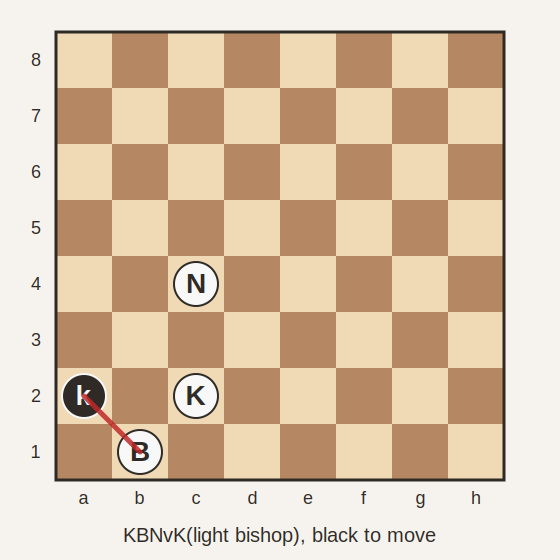

# Basic Checkmate Reachability

Reachability analysis for basic chess checkmate material.

This repository is a standalone research artifact built on top of
[ashlar-chess](https://github.com/dlbbld/ashlar-chess). Ashlar provides the
ordinary legal move generator; this project owns the finite material-class
reachability analyses, independent witness verifiers, seed-legality checks, and
the accompanying exposition.

## Motivation

In chess, the FIDE dead-position rule asks whether checkmate is possible by any
series of legal moves. That is a cooperative reachability question: can the side
with mating material reach a position where the opponent is checkmated, assuming
both players may cooperate?

For familiar material classes this sounds almost obvious. One might try to give
a direct geometric proof by separating cases such as "king in the corner",
"king on the edge", and "king in the middle". In practice this is surprisingly
fragile. Side to move, immediate checks, stalemates, forced captures, and
retro-legality all matter.

The `KBNvK` case shows why a pure hand proof is dangerous. The local position
below is a counterexample to the naive local theorem: Black is not forced to
capture a white piece on the first move, but White still has no
material-preserving cooperative path to checkmate.



```text
8/8/8/8/2N5/8/k1K5/1B6 b - - 0 1
```

The catch is that this position is not strictly legal. Black is in check from
the bishop on `b1`. If the position had arisen in a legal game, White's last
move would have had to create that check. But the bishop cannot have moved to
`b1`: the diagonal squares from which it could have arrived are blocked by the
black king on `a2` and the white king on `c2`. Nor can the check have been
discovered, because the bishop is already adjacent to the black king with no
intervening square. The position is locally coherent enough to enumerate, but it
cannot arise from the normal starting position.

This is the reason for the computational approach: enumerate the full finite
state space, compute reachability, and then verify the recorded witnesses with
the ordinary legal move generator.

## Material Classes

The current artifact covers the following classes.

Classical basic checkmates:

- `KRvK`
- `KQvK`
- `KBBvK`, with bishops on opposite-coloured squares
- `KBNvK`, with the bishop on light squares

Related basic rook endgames:

- `KRvKB(light bishop)`
- `KRvKN`

Throughout this project, `v` separates White's material from Black's material.
For example, `KRvK` means White king and rook versus Black king.

## Main Theorem Shape

The current theorem is a black-to-move statement.

For each material class, all locally legal states are enumerated. Checkmated
black-to-move states are used as terminal winning states. A reverse
reachability computation marks every state from which a material-preserving
legal path to such a checkmate exists.

The checked statement is:

> From every ongoing legal-position candidate with Black to move, if Black has
> at least one legal first move that does not immediately capture White's
> mating material, then White has a cooperative continuation to checkmate.

"Ongoing" excludes roots that are already checkmate or stalemate.

This is not adversarial search. It does not say that White can force mate
against best defense. It says that a helpmate exists: there is some legal
continuation, with both sides allowed to cooperate, that reaches Black
checkmate.

The same reachability graph also answers the white-to-move question. In that
case White directly chooses the first witness move. The local result is clean
for `KRvK` and `KQvK`: every locally legal white-to-move state is
cooperatively winnable. For the larger material classes there are small local
exception sets. These are recorded separately because their strict-game
legality still needs the same retro-analysis discipline as the black-to-move
exception in `KBNvK`.

## Verification

The analyzer stores one witness move for every winning non-terminal state. The
independent verifier then checks:

1. each terminal seed is a real Black-checkmate position;
2. each recorded witness is generated by `BitboardPosition.legalMoves(...)`;
3. the witness reaches the recorded successor;
4. the witness preserves the material class;
5. the successor is closer to a terminal mate layer.

Thus the JUnit tests do not merely sample examples. They exhaust the finite
state spaces and verify the recorded certificate edges with Ashlar's normal
legal move generator.

Run:

```sh
mvn test
```

On the current machine this test suite takes roughly two minutes.

## Current Results

Counts are over locally legal states. "Maximum witness distance" is the largest
number of material-preserving legal plies in the stored cooperative path to a
terminal mate seed. It is not adversarial depth-to-mate.

| Material class | Legal states | Black-to-move states | Black checkmates | Stalemates | Forced first capture | Counterexamples | Maximum witness distance |
|---|---:|---:|---:|---:|---:|---:|---:|
| `KRvK` | 399,112 | 223,944 | 216 | 68 | 412 | 0 | 14 |
| `KQvK` | 368,452 | 223,944 | 364 | 872 | 2,420 | 0 | 14 |
| `KBBvK`, opposite bishops | 5,973,472 | 3,469,344 | 1,552 | 5,320 | 7,952 | 0 | 16 |
| `KBNvK`, light bishop | 12,268,044 | 6,830,292 | 232 | 6,444 | 4,474 | 4 local states, 1 canonical, retro-illegal | 16 |
| `KRvKB(light bishop)` | 11,306,596 | 5,916,232 | 3,264 | 48 | 3,740 | 0 | 14 |
| `KRvKN` | 23,315,984 | 12,535,256 | 9,328 | 48 | 7,168 | 0 | 14 |

The `KRvKB(light bishop)` and `KRvKN` rows are not basic mates in the narrow
textbook sense, because Black still has a defensive piece. They are included
because they are natural practical endgames for the same reachability method.

White-to-move local reachability:

| Material class | White-to-move states | Unwinnable white-to-move states | Canonical unwinnable representatives |
|---|---:|---:|---:|
| `KRvK` | 175,168 | 0 | 0 |
| `KQvK` | 144,508 | 0 | 0 |
| `KBBvK`, opposite bishops | 2,504,128 | 24 | 3 |
| `KBNvK`, light bishop | 5,437,752 | 60 | 15 |
| `KRvKB(light bishop)` | 5,390,364 | 8 | 2 |
| `KRvKN` | 10,780,728 | 32 | 4 |

These white-to-move exceptions are local material-class exceptions, not yet a
claim about positions reachable from an ordinary game. The witness verifier
already checks all white-to-move winning states, because the stored witness
edges are side-to-move agnostic.

## Strict-Legality Seed Checks

The main reachability enumeration works with local legality. A separate
strict-legality experiment starts from a known game-reachable seed position and
flood-fills forward using ordinary legal moves that preserve the material class.

This proves that every reached state is strictly legal in the sense of being
reachable from the normal starting position, assuming the seed itself has a
legal proof game.

Current seed checks:

| Material class | Seed | Legal states | Reached states | Unreached states | Unreached black-to-move non-check states |
|---|---|---:|---:|---:|---:|
| `KRvK` | `Ke1 Ra1 ke8 b` | 399,112 | 399,064 | 48 | 0 |
| `KQvK` | `Ke1 Qd1 ke8 b` | 368,452 | 368,452 | 0 | 0 |
| `KBNvK(light bishop)` | `Ke1 Bf1 Nb1 ke8 b` | 12,268,044 | 12,169,754 | 98,290 | 0 |
| `KBBvK(opposite bishops)` | `Ke1 Bf1 Bc1 ke8 b` | 5,973,472 | 5,929,808 | 43,664 | 0 |

The important pattern is that all checked classes reach every black-to-move
non-check state from the original-piece seed. The unreached states, where they
exist, are in-check states or white-to-move states that may require separate
last-move or "entered by capture" retro analysis.

## Status

Implemented:

- finite-state theorem analyzers;
- independent witness verifiers;
- JUnit tests pinning all current counts;
- seed strict-legality checks for `KRvK`, `KQvK`, `KBNvK(light bishop)`, and
  `KBBvK(opposite bishops)`;
- exposition draft in
  [docs/basic-checkmate-helpmate-exposition.md](docs/basic-checkmate-helpmate-exposition.md).

Not yet implemented:

- a complete strict-legality classification for all unreached in-check states;
- a strict-game classification of the local white-to-move exception sets;
- seed strict-legality checks for `KRvKB(light bishop)` and `KRvKN`;
- machine-readable exported result tables and representative FEN sets.

## Dependency

This project uses the Maven Central release of Ashlar Chess:

```xml
<dependency>
  <groupId>io.github.dlbbld</groupId>
  <artifactId>ashlar-chess</artifactId>
  <version>17.0.0</version>
</dependency>
```
