# Basic Helpmate Existence

Current release: [2.0.0 — KBNvK Theorem Correction](CHANGELOG.md#200--kbnvk-theorem-correction--2026-10-06).

This project delivers a finite-state proof by code for basic helpmate existence in selected low-material chess endgames, with explicit forced-capture and `KBNvK` promotion-trap exceptions. It is supplemented by sufficient, machine-checkable last-move illegality certificates for the remaining positions where the conclusion does not hold.

The covered material classes are `KRvK`, `KQvK`, `KBBvK` with opposite-coloured bishops, `KBNvK`, `KNNvK`, `KRvKB`, and `KRvKN`, together with their colour-reversed counterparts.

Version 2.0 changes the theorem's scope by explicitly excluding legal `KBNvK` promotion traps. The broader `KBNvK` statement in version 1.x is false.

## Theorem

Let `M` be the side with the mating material, and let `D` be the defending side. In every legal position in the material classes above that is neither checkmate nor stalemate, and is outside the `KBNvK` promotion traps specified below:

1.  If `M` is to move, then `M` has a helpmate.

2.  If `D` is to move, then `M` has a helpmate unless `D`'s only legal first moves are captures of one of `M`'s pieces.


Equivalently, spelled out by colour:

Both statements have the same exclusions for checkmate, stalemate, and the explicit `KBNvK` promotion traps.

* White has the mating material: if White is to move, White has a helpmate; if Black is to move, White has a helpmate unless Black's only legal first moves are captures of one of White's pieces.

* Black has the mating material: if Black is to move, Black has a helpmate; if White is to move, Black has a helpmate unless White's only legal first moves are captures of one of Black's pieces.

### Terminal and dead positions

Legal here concerns board reachability from the initial position by ordinary legal moves (the movement and king-safety rules of Article 3). Checkmates and stalemates are excluded. The tables use “ongoing” only as a structural count: neither checkmate nor stalemate. This does not assert that a game may continue after a dead position, or past other game-ending rules.

A legal position can also be dead: neither side can reach checkmate by any legal continuation. Such a position immediately ends the game under [FIDE Article 5.2.2](https://handbook.fide.com/chapter/E012023). The promotion traps below are dead positions even though legal moves remain. Excluding all dead positions by definition would make the bare-king helpmate claim circular, so the theorem instead gives explicit, testable exclusions. “Helpmate” means cooperative reachability of mate, not a forced win against best defence.

### KBNvK promotion traps

With White holding the bishop and knight, exclude these exact placements (all other squares empty):

| Side to move | White king | White bishop | White knight | Black king |
| --- | --- | --- | --- | --- |
| White | `f7` | `g8` | one of `e8`, `e6`, `f5`, `h5` | `h8` |
| Black | `f7` | `g8` | `f5` | `h7` |

Also exclude their reflections across files: White king `c7`, bishop `b8`, knight respectively `d8`, `d6`, `c5`, `a5`, and Black king `a8` (White to move), or knight `c5` and Black king `a7` (Black to move). This gives eight White-to-move and two Black-to-move traps, including both bishop colours. For Black holding the material, reverse colours and reflect ranks, putting Black's promotion square on rank 1.

These are exceptions based on the current placement and side to move; no promotion-history flag is needed. A bishop on rank 8 alone is not an exception. In particular the analogous White-to-move placement with knight `g7` is illegal: the knight blocks the pawn's `g7` promotion source, while `f7` and `h7` are occupied in the required predecessor.

The supplied example is:

```pgn
[Variant "From Position"]
[FEN "4N3/5KPk/8/8/8/8/8/8 w - - 0 1"]

1. g8=B+ Kh8
```

After `g8=B+`, Black can also choose `Kh6`; the cooperative line `Kh6 Bh7 Kh5 Nd6 Kh6 Kf6 Kh5 Bg6+ Kh6 Nf7#` reaches mate. After `Kh8`, White has no helpmate. Moving the bishop to `h7` forces its capture; moving the knight leaves Black without a legal move; moving the king either stalemates Black or allows only capture of the bishop. The final position is legal and dead.

[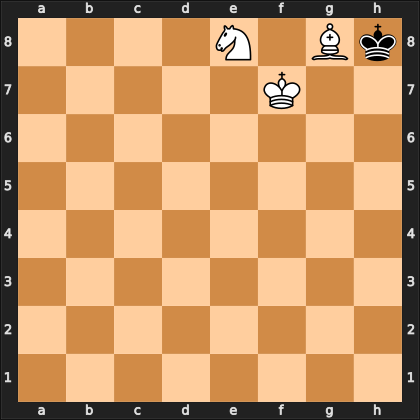](https://lichess.org/analysis/standard/4N1Bk/5K2/8/8/8/8/8/8_w_-_-_0_1)

For the Black-to-move trap, start instead with `8/5KPk/8/5N2/8/8/8/8 w - - 0 1` and play `g8=B+`. Black has the noncapturing move `Kh8`, but no continuation to mate. This is already a dead position at promotion. `Kh8` reaches the White-to-move `Nf5` trap in the ordinary legal-move graph, but an actual game has already ended and must not continue. The analogous distinction applies to the file-reflected `Nc5` trap. The other six White-to-move traps, including the supplied `Ne8` example, can first become dead on the king's move. All ten placements are explicitly excluded so the statement is safe for both board-graph analysis and actual game adjudication.

`TestKbnPromotionExceptions` replays ordinary legal move sequences from the initial position for all ten trap placements and independently searches their forward continuations with Ashlar's ordinary legal move generator. It explicitly documents the already-ended predecessor of the White-to-move `Nf5`/`Nc5` cases. The seed games are in `src/test/resources/proof-games/KNPvK-*-pawn.pgn`.

### Finite-state proof

The computation is performed with White as `M` for the seven material classes listed above. The corresponding Black-side statements follow by reversing colours and reflecting ranks in the forward move graph and local illegality arguments. This preserves pawn direction, promotion, legal moves, captures, checkmate, and helpmate existence; Black's promotion rank is then rank 1.

The finite-state proof by code covers the light-square bishop case for `KBNvK` and `KRvKB`. The dark-square bishop reachability computation follows by board symmetry of the pawn-free forward graph. Historical legality does not follow by arbitrary board symmetry: a rotation can turn an impossible bishop arrival into a legal promotion. The `KBNvK` illegality audit therefore expands all eight orientations and checks both bishop colours separately.

### Supplementary two-major check

The main theorem is about basic material classes, so `KRRvK` and `KQQvK` are not included in it. The tests nevertheless include the following supplementary check: in every potentially legal exact `KRRvK` or `KQQvK` position that is not already checkmate or stalemate, White has a helpmate, no matter which side is to move.

This is a separate finite-state computation rather than an extension of the exception pattern above. In these two-major classes the defending king can have a forced first capture of one rook or one queen, and White can still have a helpmate because the remaining `KRvK` or `KQvK` material is enough. Although this may look obvious geometrically, checking it prevents the same kind of side-to-move, stalemate, and forced-capture oversights that motivated the main theorem.

The test `TestTwoMajorPieceWinnabilityAnalysis` checks a combined state space: exact `KRRvK` together with auxiliary `KRvK`, and exact `KQQvK` together with auxiliary `KQvK`. A black move is allowed to capture one of two major pieces, moving into the auxiliary one-major layer; a move that captures the last major piece is not used as a mate-reaching continuation.

#### All potentially legal positions

| Material class | Potentially legal positions | Checkmates | Stalemates | Ongoing positions | Forced first capture (total 1 move) | Forced first capture (total 2 moves) | Counterexamples | Maximum helpmate plies |
| --- | --- | --- | --- | --- | --- | --- | --- | --- |
| `KRRvK` | 10,992,884 | 72,392 | 19,580 | 10,900,912 | 80,456 | 9,952 | 0 | 14 |
| `KQQvK` | 9,658,852 | 251,880 | 141,176 | 9,265,796 | 242,216 | 16,448 | 0 | 14 |

#### Potentially legal positions reduced to representative cases

| Material class | Potentially legal positions | Checkmates | Stalemates | Ongoing positions | Forced first capture (total 1 move) | Forced first capture (total 2 moves) | Counterexamples | Maximum helpmate plies |
| --- | --- | --- | --- | --- | --- | --- | --- | --- |
| `KRRvK` | 1,374,940 | 9,052 | 2,468 | 1,363,420 | 10,072 | 1,262 | 0 | 14 |
| `KQQvK` | 1,208,031 | 31,523 | 17,672 | 1,158,836 | 30,282 | 2,056 | 0 | 14 |

## Motivation and difficulty

In chess, the FIDE rule on flag fall asks whether the opponent still has a helpmate; only then is the game a loss for the flagging player. This motivates checking whether the side with mating material has any possible cooperative continuation to checkmate, without having to construct such a continuation during adjudication.

For familiar material classes this sounds almost obvious. One might try to give a direct geometric proof by separating cases such as "king in the corner", "king on the edge", and "king in the middle". In practice this is surprisingly fragile. Side to move, immediate checks, stalemates, forced captures, and positions being illegal or not all matter.

The theorem is therefore proved by going through all potentially legal positions in the finite material class instead of relying on a hand proof over geometric cases.

A possible use is for an algorithm proving winnability for such positions. Instead of proving winnability by explicitly constructing a helpmate, the algorithm can rely on this theorem, and as such for these positions determine winnability more efficiently.

## High-level algorithmic picture

There are two main algorithms.

The first algorithm finds the theorem. For a fixed material class, it goes through all potentially legal positions in that material class. It then starts from every checkmate position and works backwards through legal moves. Whenever a position can legally move to a position already known to reach mate, it is also marked as reaching mate. Instead of trying a fresh helpmate search from each position, it computes the whole material class at once.

The second algorithm verifies the theorem. During the computation, the analyzer stores one witness move for each non-terminal position it marks as winning. The verifier reconstructs each source position, asks Ashlar Chess's ordinary legal move generator for the legal moves, checks that the stored witness is one of them, checks that it reaches the recorded successor, and checks that the successor is closer to checkmate. Therefore every accepted position has a finite chain of ordinary legal moves to mate.

The recorded distance is the length of this witnessed chain in plies. The maximum helpmate plies shown below is not a depth-to-mate under best defense. It is the largest number of plies needed by the cooperative reachability proof.

## Terms

### Legal and illegal position

The FIDE laws of chess call a position which cannot arise from the starting position by a series of legal moves an "illegal position". We call a position that can arise from the starting position by a series of legal moves a "legal position".

### Potentially legal position

Within the exact material class, the computation requires distinct occupied squares, nonadjacent kings, and that the king of the player not having the move is not in check. We call such a position a "potentially legal position". This is not a historical legality test: some such positions cannot arise from the initial position.

### Representative position

A position can have up to eight symmetric positions by mirroring and rotation. We call one chosen member of such a symmetry class a "representative position". Counts below are given both for all positions and for positions reduced to one representative per symmetry class. These symmetries preserve pawn-free forward moves and helpmate existence, but a representative's historical illegality must not be transferred to its whole orbit without checking promotion in each orientation.

## Positions not satisfying the unqualified conclusion

The finite-state computation checks all potentially legal positions. A witnessed helpmate needs no historical legality decision. Every unwinnable position must instead be covered by an explicit exception or a sufficient illegality certificate. The original argument incorrectly classified all `KBNvK` failures as illegal; promotion produces the legal traps above.

For the remaining failures, the certificates formalize last-move or last-two-move arguments. Returning false means only that the certificate cannot prove illegality; it does not establish global legality. Proof games establish legality for the explicit promotion exceptions.

The board diagrams below are generated locally by `scripts/render_readme_boards.py` using `python-chess`. They use the Colin M. L. Burnett SVG chess pieces and include rank and file coordinates. The Lichess links are kept only as analysis-board links.

### White to move

The following representatives do not satisfy the unqualified conclusion for White to move. Each is illegal in its displayed orientation. Some `KBNvK` representatives have legal promotion-trap orientations; those are excluded explicitly above.

#### KBBvK, opposite bishops

| No. | Material class | Side to move | Representative position | Status |
| --- | --- | --- | --- | --- |
| 1 | `KBBvK`, opposite bishops | White | [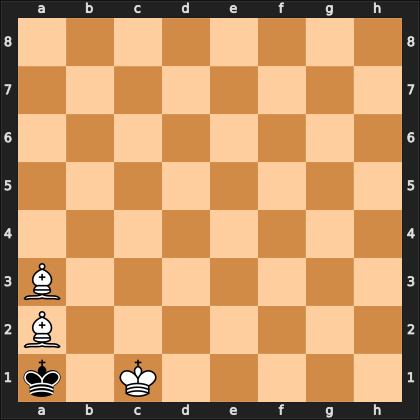](https://lichess.org/analysis/standard/8/8/8/8/8/B7/B7/k1K5_w_-_-_0_1)<br>`8/8/8/8/8/B7/B7/k1K5 w - - 0 1`<br>[Lichess analysis](https://lichess.org/analysis/standard/8/8/8/8/8/B7/B7/k1K5_w_-_-_0_1) | illegal position |
| 2 | `KBBvK`, opposite bishops | White | [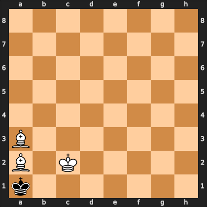](https://lichess.org/analysis/standard/8/8/8/8/8/B7/B1K5/k7_w_-_-_0_1)<br>`8/8/8/8/8/B7/B1K5/k7 w - - 0 1`<br>[Lichess analysis](https://lichess.org/analysis/standard/8/8/8/8/8/B7/B1K5/k7_w_-_-_0_1) | illegal position |
| 3 | `KBBvK`, opposite bishops | White | [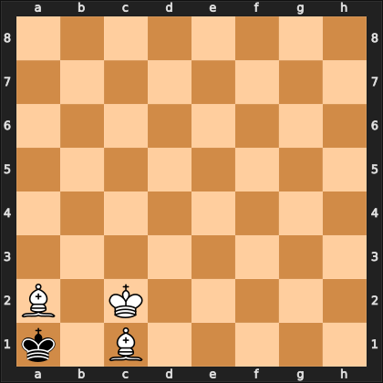](https://lichess.org/analysis/standard/8/8/8/8/8/8/B1K5/k1B5_w_-_-_0_1)<br>`8/8/8/8/8/8/B1K5/k1B5 w - - 0 1`<br>[Lichess analysis](https://lichess.org/analysis/standard/8/8/8/8/8/8/B1K5/k1B5_w_-_-_0_1) | illegal position |

These three representatives are illegal. Since White is to move and Black has only a king, Black's previous move would have had to be a king move to `a1` in the displayed representatives. The only possible predecessor square not immediately ruled out by king adjacency is `a2`, but in each `KBBvK` representative `a2` is occupied by a white bishop. Hence there is no legal black last move, so the position must be illegal.

#### KBNvK, light bishop

| No. | Material class | Side to move | Representative position | Status |
| --- | --- | --- | --- | --- |
| 1 | `KBNvK`, light bishop | White | [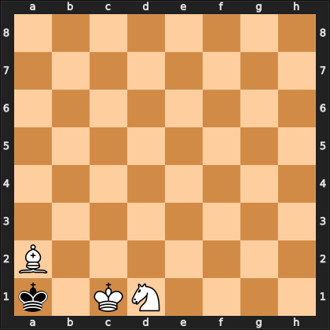](https://lichess.org/analysis/standard/8/8/8/8/8/8/B7/k1KN4_w_-_-_0_1)<br>`8/8/8/8/8/8/B7/k1KN4 w - - 0 1`<br>[Lichess analysis](https://lichess.org/analysis/standard/8/8/8/8/8/8/B7/k1KN4_w_-_-_0_1) | illegal position |
| 2 | `KBNvK`, light bishop | White | [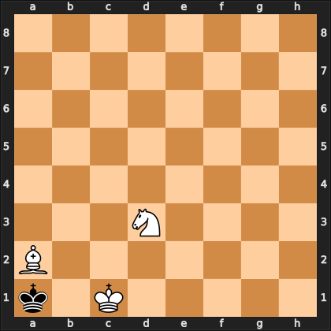](https://lichess.org/analysis/standard/8/8/8/8/8/3N4/B7/k1K5_w_-_-_0_1)<br>`8/8/8/8/8/3N4/B7/k1K5 w - - 0 1`<br>[Lichess analysis](https://lichess.org/analysis/standard/8/8/8/8/8/3N4/B7/k1K5_w_-_-_0_1) | illegal position |
| 3 | `KBNvK`, light bishop | White | [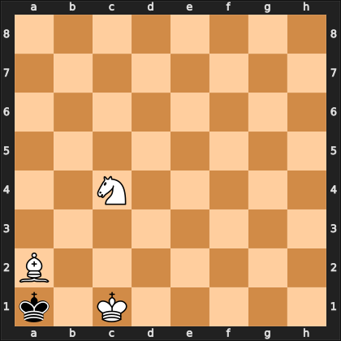](https://lichess.org/analysis/standard/8/8/8/8/2N5/8/B7/k1K5_w_-_-_0_1)<br>`8/8/8/8/2N5/8/B7/k1K5 w - - 0 1`<br>[Lichess analysis](https://lichess.org/analysis/standard/8/8/8/8/2N5/8/B7/k1K5_w_-_-_0_1) | illegal position |
| 4 | `KBNvK`, light bishop | White | [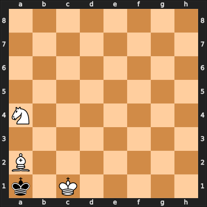](https://lichess.org/analysis/standard/8/8/8/8/N7/8/B7/k1K5_w_-_-_0_1)<br>`8/8/8/8/N7/8/B7/k1K5 w - - 0 1`<br>[Lichess analysis](https://lichess.org/analysis/standard/8/8/8/8/N7/8/B7/k1K5_w_-_-_0_1) | illegal position |
| 5 | `KBNvK`, light bishop | White | [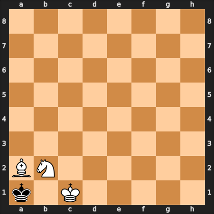](https://lichess.org/analysis/standard/8/8/8/8/8/8/BN6/k1K5_w_-_-_0_1)<br>`8/8/8/8/8/8/BN6/k1K5 w - - 0 1`<br>[Lichess analysis](https://lichess.org/analysis/standard/8/8/8/8/8/8/BN6/k1K5_w_-_-_0_1) | illegal position |
| 6 | `KBNvK`, light bishop | White | [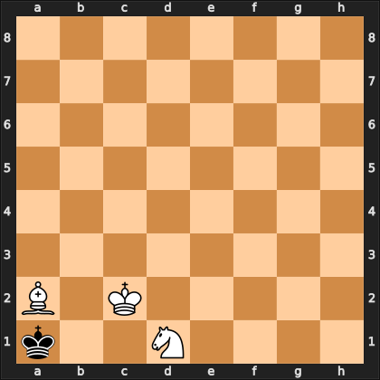](https://lichess.org/analysis/standard/8/8/8/8/8/8/B1K5/k2N4_w_-_-_0_1)<br>`8/8/8/8/8/8/B1K5/k2N4 w - - 0 1`<br>[Lichess analysis](https://lichess.org/analysis/standard/8/8/8/8/8/8/B1K5/k2N4_w_-_-_0_1) | illegal position |
| 7 | `KBNvK`, light bishop | White | [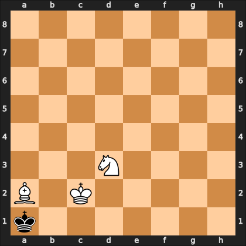](https://lichess.org/analysis/standard/8/8/8/8/8/3N4/B1K5/k7_w_-_-_0_1)<br>`8/8/8/8/8/3N4/B1K5/k7 w - - 0 1`<br>[Lichess analysis](https://lichess.org/analysis/standard/8/8/8/8/8/3N4/B1K5/k7_w_-_-_0_1) | illegal position |
| 8 | `KBNvK`, light bishop | White | [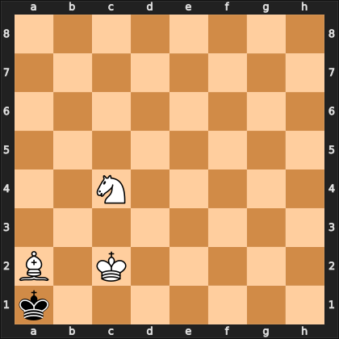](https://lichess.org/analysis/standard/8/8/8/8/2N5/8/B1K5/k7_w_-_-_0_1)<br>`8/8/8/8/2N5/8/B1K5/k7 w - - 0 1`<br>[Lichess analysis](https://lichess.org/analysis/standard/8/8/8/8/2N5/8/B1K5/k7_w_-_-_0_1) | illegal position |
| 9 | `KBNvK`, light bishop | White | [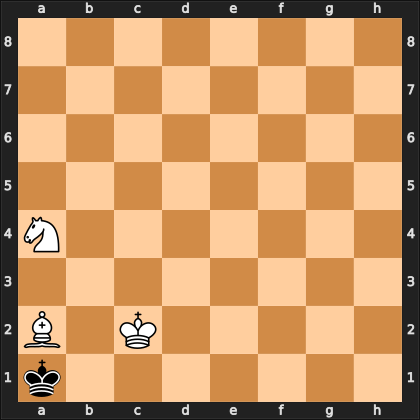](https://lichess.org/analysis/standard/8/8/8/8/N7/8/B1K5/k7_w_-_-_0_1)<br>`8/8/8/8/N7/8/B1K5/k7 w - - 0 1`<br>[Lichess analysis](https://lichess.org/analysis/standard/8/8/8/8/N7/8/B1K5/k7_w_-_-_0_1) | illegal position |
| 10 | `KBNvK`, light bishop | White | [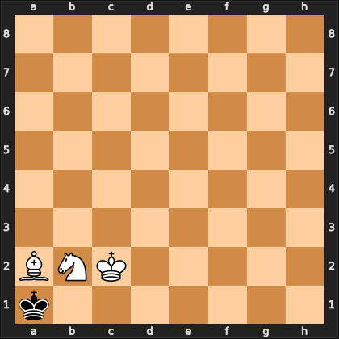](https://lichess.org/analysis/standard/8/8/8/8/8/8/BNK5/k7_w_-_-_0_1)<br>`8/8/8/8/8/8/BNK5/k7 w - - 0 1`<br>[Lichess analysis](https://lichess.org/analysis/standard/8/8/8/8/8/8/BNK5/k7_w_-_-_0_1) | illegal position |
| 11 | `KBNvK`, light bishop | White | [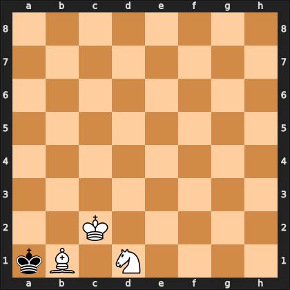](https://lichess.org/analysis/standard/8/8/8/8/8/8/2K5/kB1N4_w_-_-_0_1)<br>`8/8/8/8/8/8/2K5/kB1N4 w - - 0 1`<br>[Lichess analysis](https://lichess.org/analysis/standard/8/8/8/8/8/8/2K5/kB1N4_w_-_-_0_1) | illegal position |
| 12 | `KBNvK`, light bishop | White | [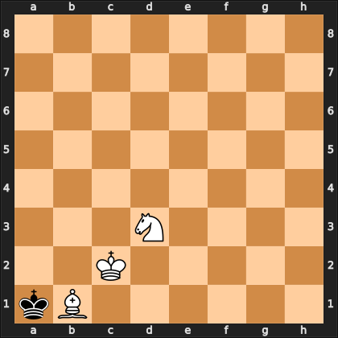](https://lichess.org/analysis/standard/8/8/8/8/8/3N4/2K5/kB6_w_-_-_0_1)<br>`8/8/8/8/8/3N4/2K5/kB6 w - - 0 1`<br>[Lichess analysis](https://lichess.org/analysis/standard/8/8/8/8/8/3N4/2K5/kB6_w_-_-_0_1) | illegal position |
| 13 | `KBNvK`, light bishop | White | [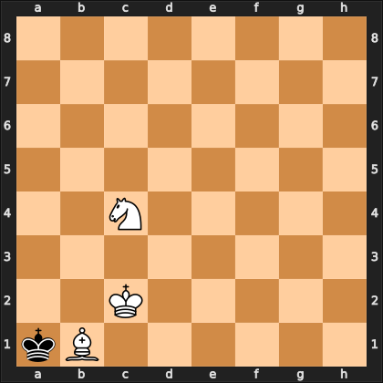](https://lichess.org/analysis/standard/8/8/8/8/2N5/8/2K5/kB6_w_-_-_0_1)<br>`8/8/8/8/2N5/8/2K5/kB6 w - - 0 1`<br>[Lichess analysis](https://lichess.org/analysis/standard/8/8/8/8/2N5/8/2K5/kB6_w_-_-_0_1) | illegal position |
| 14 | `KBNvK`, light bishop | White | [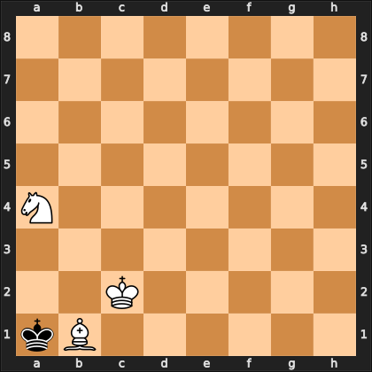](https://lichess.org/analysis/standard/8/8/8/8/N7/8/2K5/kB6_w_-_-_0_1)<br>`8/8/8/8/N7/8/2K5/kB6 w - - 0 1`<br>[Lichess analysis](https://lichess.org/analysis/standard/8/8/8/8/N7/8/2K5/kB6_w_-_-_0_1) | illegal position |
| 15 | `KBNvK`, light bishop | White | [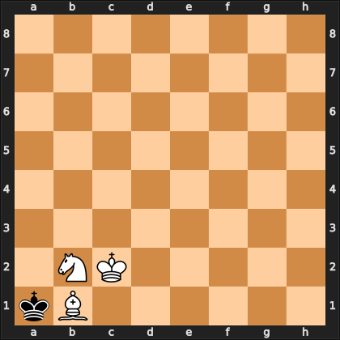](https://lichess.org/analysis/standard/8/8/8/8/8/8/1NK5/kB6_w_-_-_0_1)<br>`8/8/8/8/8/8/1NK5/kB6 w - - 0 1`<br>[Lichess analysis](https://lichess.org/analysis/standard/8/8/8/8/8/8/1NK5/kB6_w_-_-_0_1) | illegal position |

For rows with a bishop on `a2`, all possible black-king source squares are occupied or adjacent to the white king, so no last king move is possible. For rows with a bishop on `b1`, Black could have moved from `a2` out of check to `a1`: being attacked on the source square is not an illegality reason. Instead examine the preceding White move. The bishop on `b1` gives adjacent check to the king on `a2`, cannot have arrived along either blocked diagonal, and cannot have promoted on rank 1. That predecessor is illegal, even if Black's king move captured a white piece on `a1`. Thus these displayed positions are illegal by a two-move argument. This reasoning is rechecked in each orientation; rotations onto rank 8 can admit promotion.

#### Machine-checkable illegality algorithm

1. Black made the last move, because White is to move.
2. Black has only a king in `KBBvK` and `KBNvK`, so Black's last move must have been a king move.
3. The algorithm enumerates every adjacent source square of the current black king square.
4. A source square is rejected if it is occupied now or adjacent to the white king. A check on the source square is allowed: the king may have moved out of check.
5. If every adjacent source square is rejected, then there is no possible last black king move, so the position is illegal.
6. If sources remain, the two-move certificate reconstructs each predecessor, both without a capture and with a conservative neutral blocker on the capture square, and checks whether White could have produced the preceding adjacent check. It rejects a position only if every predecessor is impossible.

### Black to move

#### KBNvK, light bishop

There are four light-bishop Black-to-move failures outside checkmate, stalemate, and forced first capture. They form one orbit in the pawn-free graph. Three are illegal; the orientation with bishop `g8`, king `f7`, knight `f5`, and black king `h7` is a legal promotion trap. The representative below is illegal only in its displayed orientation.

| No. | Material class | Side to move | Representative position | Status |
| --- | --- | --- | --- | --- |
| 1 | `KBNvK(light bishop)` | Black | [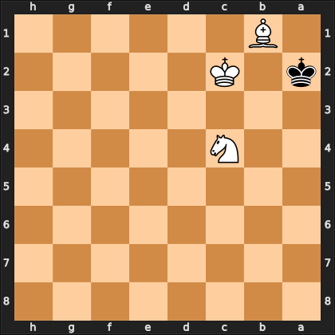](https://lichess.org/analysis/standard/8/8/8/8/2N5/8/k1K5/1B6_b_-_-_0_1)<br>`8/8/8/8/2N5/8/k1K5/1B6 b - - 0 1`<br>[Lichess analysis](https://lichess.org/analysis/standard/8/8/8/8/2N5/8/k1K5/1B6_b_-_-_0_1) | illegal position |

Black is in adjacent check from the bishop on `b1`. White must have created that check, but neither an ordinary bishop move along the blocked diagonals nor a discovered check is possible. White cannot promote on `b1`, so this displayed placement is illegal. Its rank-8 orientation permits `g8=B+`, invalidating the former claim that the whole orbit was illegal.

#### Machine-checkable illegality algorithm

1. White made the last move, because Black is to move.
2. Black is in check, so White's last move must have created a check by a piece move, promotion, castling, or discovery.
3. The algorithm looks for an adjacent checking white sliding piece. Even if another piece also checks, this particular adjacent check must have been created.
4. Because the checker is adjacent to the king, no discovered check is possible: there is no square between checker and king from which a blocker could have moved away.
5. Therefore the checking piece must have moved to its present square or been created there by promotion. A conservative guard also allows a rook's possible castling arrival.
6. The algorithm enumerates that checking piece's possible source squares.
7. If ordinary source rays are blocked, the algorithm checks rank-8 pawn origins for both straight and capture promotion. A capture predecessor restores a black blocker on the promotion square. Black must not already have been in check before White moved. If any promotion predecessor survives, the certificate does not claim illegality.
8. Only when all supported arrivals are impossible does the certificate prove illegality. This is a sufficient certificate, not a complete retrograde legality solver.

The audit also checked captures that change material, capture promotions, discovered and double checks, castling, and en passant. A last black king move may capture an extra white piece, so the two-move certificate allows a capture blocker. Black having only a king rules out Black's last move being castling, promotion, or en passant. An adjacent sliding check has no intervening square for an ordinary or en passant discovered check. Castling is guarded conservatively in the generic sliding-piece certificate. The `KBBvK` failures still have no possible last king move in any orientation; the other material classes have no unaccounted potentially legal failures in the existing computations.

## Verification

The analyzer stores one witness move for every winning non-terminal state. The independent verifier then checks:

1.  each terminal seed is a real Black-checkmate position;
    
2.  each recorded witness is generated by `BitboardPosition.legalMoves(...)`;
    
3.  the witness reaches the recorded successor;
    
4.  the witness preserves the material class;
    
5.  the successor is closer to a terminal mate layer.
    

Thus the JUnit tests do not merely sample examples. They exhaust the finite state spaces and verify the recorded witness moves with Ashlar's normal legal move generator.

Run:

```sh
mvn test

```

## Current Position Counts for White to move

"Maximum helpmate plies" is the largest number of legal plies in the stored helpmate path to checkmate inside the fixed material class.

### All potentially legal positions

| Material class | Potentially legal positions | Checkmates | Stalemates | Counterexamples | Maximum helpmate plies |
| --- | --- | --- | --- | --- | --- |
| `KRvK` | 175,168 | 0 | 0 | 0 | 13 |
| `KQvK` | 144,508 | 0 | 0 | 0 | 13 |
| `KBBvK`, opposite bishops | 2,504,128 | 0 | 0 | 24 illegal | 15 |
| `KBNvK`, light bishop | 5,437,752 | 0 | 0 | 56 illegal, 4 legal promotion traps | 15 |
| `KNNvK` | 5,749,652 | 0 | 0 | 0 | 15 |
| `KRvKB(light bishop)` | 5,390,364 | 0 | 0 | 0 | 13 |
| `KRvKN` | 10,780,728 | 8 | 0 | 0 | 13 |

The nonzero rows count failures of the former unqualified conclusion. `KBBvK` failures are all illegal. For the light-bishop `KBNvK` computation, 56 failures are illegal and four are legal promotion traps; the dark-bishop case has the same split. Historical legality is audited in every orientation, not inferred from representative counts.

### Potentially legal positions reduced to representative cases

| Material class | Potentially legal positions | Checkmates | Stalemates | Counterexamples | Maximum helpmate plies |
| --- | --- | --- | --- | --- | --- |
| `KRvK` | 21,959 | 0 | 0 | 0 | 13 |
| `KQvK` | 18,081 | 0 | 0 | 0 | 13 |
| `KBBvK`, opposite bishops | 626,032 | 0 | 0 | 3 illegal | 15 |
| `KBNvK`, light bishop | 1,359,578 | 0 | 0 | 15 shapes; 4 contain legal promotion traps | 15 |
| `KNNvK` | 719,130 | 0 | 0 | 0 | 15 |
| `KRvKB(light bishop)` | 1,347,906 | 0 | 0 | 0 | 13 |
| `KRvKN` | 1,347,906 | 1 | 0 | 0 | 13 |

## Current Position Counts for Black to move

The forced first capture exception is split by the total number of legal moves available to the defending side. In every such exception, the defending side has at most two legal moves; a position with three or more legal defending moves is immediately outside the exception.

### All potentially legal positions

| Material class | Potentially legal positions | Checkmates | Stalemates | Forced first capture (total 1 move) | Forced first capture (total 2 moves) | Counterexamples | Maximum helpmate plies |
| --- | --- | --- | --- | --- | --- | --- | --- |
| `KRvK` | 223,944 | 216 | 68 | 412 | 0 | 0 | 14 |
| `KQvK` | 223,944 | 364 | 872 | 2,420 | 0 | 0 | 14 |
| `KBBvK`, opposite bishops | 3,469,344 | 1,552 | 5,320 | 7,312 | 640 | 0 | 16 |
| `KBNvK`, light bishop | 6,830,292 | 232 | 6,444 | 4,042 | 432 | 3 illegal, 1 legal promotion trap | 16 |
| `KNNvK` | 6,830,292 | 120 | 3,864 | 1,708 | 124 | 0 | 16 |
| `KRvKB(light bishop)` | 5,916,232 | 3,264 | 48 | 3,152 | 588 | 0 | 14 |
| `KRvKN` | 12,535,256 | 9,328 | 48 | 6,848 | 320 | 0 | 14 |

### Potentially legal positions reduced to representative cases

| Material class | Potentially legal positions | Checkmates | Stalemates | Forced first capture (total 1 move) | Forced first capture (total 2 moves) | Counterexamples | Maximum helpmate plies |
| --- | --- | --- | --- | --- | --- | --- | --- |
| `KRvK` | 28,056 | 27 | 9 | 54 | 0 | 0 | 14 |
| `KQvK` | 28,056 | 46 | 109 | 305 | 0 | 0 | 14 |
| `KBBvK`, opposite bishops | 867,336 | 194 | 665 | 914 | 80 | 0 | 16 |
| `KBNvK`, light bishop | 1,707,888 | 58 | 1,611 | 1,013 | 108 | 1 shape containing a legal promotion trap | 16 |
| `KNNvK` | 854,238 | 15 | 484 | 216 | 16 | 0 | 16 |
| `KRvKB(light bishop)` | 1,479,198 | 816 | 12 | 788 | 147 | 0 | 14 |
| `KRvKN` | 1,567,222 | 1,166 | 6 | 856 | 40 | 0 | 14 |

For `KBBvK`, the total number of potentially legal representative positions uses the bishop-colour-preserving symmetries of the theorem class. The checkmate, stalemate, and forced-capture sub-counts use the full board-symmetry representative count, because those event sets are invariant under the full board-symmetry group.

## Forced first capture

The following table gives the first representative example encountered by the analysis for each material class with a forced first capture. If a material class also has a forced first capture where the defending side has two legal moves, the first such representative is included as well.

Although the analysis ranges over potentially legal positions, all examples below are legal positions. This is backed by proof games from the initial chess position.

| Example | Material class | Side to move | Representative position | Status | Total legal moves |
| --- | --- | --- | --- | --- | ---: |
| 1 | `KRvK` | Black | [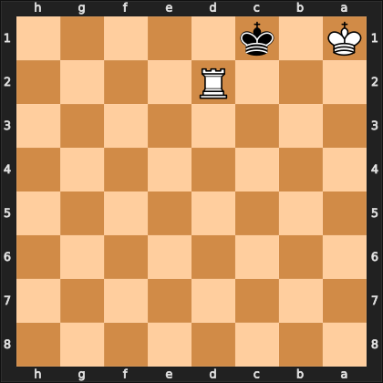](https://lichess.org/analysis/standard/8/8/8/8/8/8/3R4/K1k5_b_-_-_0_1)<br>`8/8/8/8/8/8/3R4/K1k5 b - - 0 1`<br>[Lichess analysis](https://lichess.org/analysis/standard/8/8/8/8/8/8/3R4/K1k5_b_-_-_0_1) | legal position | 1 |
| 2 | `KQvK` | Black | [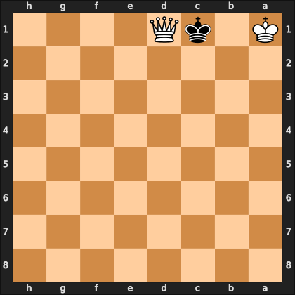](https://lichess.org/analysis/standard/8/8/8/8/8/8/8/K1kQ4_b_-_-_0_1)<br>`8/8/8/8/8/8/8/K1kQ4 b - - 0 1`<br>[Lichess analysis](https://lichess.org/analysis/standard/8/8/8/8/8/8/8/K1kQ4_b_-_-_0_1) | legal position | 1 |
| 3 | `KBBvK`, opposite bishops | Black | [](https://lichess.org/analysis/standard/8/8/8/8/8/8/8/K1kBB3_b_-_-_0_1)<br>`8/8/8/8/8/8/8/K1kBB3 b - - 0 1`<br>[Lichess analysis](https://lichess.org/analysis/standard/8/8/8/8/8/8/8/K1kBB3_b_-_-_0_1) | legal position | 1 |
| 4 | `KBBvK`, opposite bishops | Black | [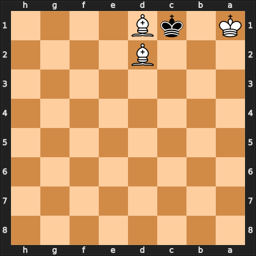](https://lichess.org/analysis/standard/8/8/8/8/8/8/3B4/K1kB4_b_-_-_0_1)<br>`8/8/8/8/8/8/3B4/K1kB4 b - - 0 1`<br>[Lichess analysis](https://lichess.org/analysis/standard/8/8/8/8/8/8/3B4/K1kB4_b_-_-_0_1) | legal position | 2 |
| 5 | `KBNvK`, light bishop | Black | [](https://lichess.org/analysis/standard/8/8/8/8/8/8/8/KNkB4_b_-_-_0_1)<br>`8/8/8/8/8/8/8/KNkB4 b - - 0 1`<br>[Lichess analysis](https://lichess.org/analysis/standard/8/8/8/8/8/8/8/KNkB4_b_-_-_0_1) | legal position | 1 |
| 6 | `KBNvK`, light bishop | Black | [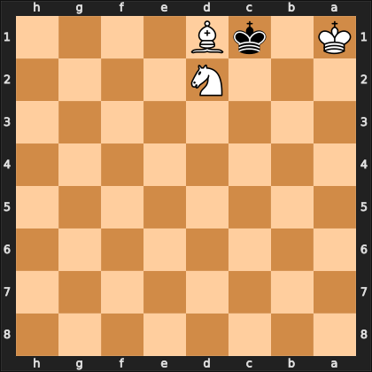](https://lichess.org/analysis/standard/8/8/8/8/8/8/3N4/K1kB4_b_-_-_0_1)<br>`8/8/8/8/8/8/3N4/K1kB4 b - - 0 1`<br>[Lichess analysis](https://lichess.org/analysis/standard/8/8/8/8/8/8/3N4/K1kB4_b_-_-_0_1) | legal position | 2 |
| 7 | `KNNvK` | Black | [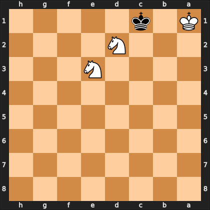](https://lichess.org/analysis/standard/8/8/8/8/8/4N3/3N4/K1k5_b_-_-_0_1)<br>`8/8/8/8/8/4N3/3N4/K1k5 b - - 0 1`<br>[Lichess analysis](https://lichess.org/analysis/standard/8/8/8/8/8/4N3/3N4/K1k5_b_-_-_0_1) | legal position | 1 |
| 8 | `KNNvK` | Black | [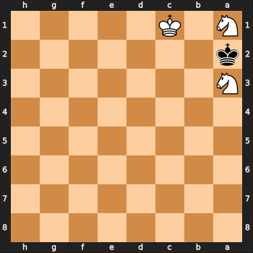](https://lichess.org/analysis/standard/8/8/8/8/8/N7/k7/N1K5_b_-_-_0_1)<br>`8/8/8/8/8/N7/k7/N1K5 b - - 0 1`<br>[Lichess analysis](https://lichess.org/analysis/standard/8/8/8/8/8/N7/k7/N1K5_b_-_-_0_1) | legal position | 2 |
| 9 | `KRvKB(light bishop)` | Black | [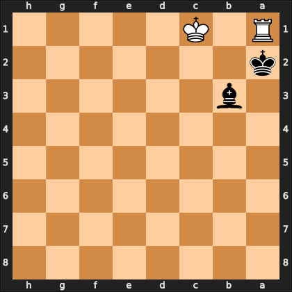](https://lichess.org/analysis/standard/8/8/8/8/8/1b6/k7/R1K5_b_-_-_0_1)<br>`8/8/8/8/8/1b6/k7/R1K5 b - - 0 1`<br>[Lichess analysis](https://lichess.org/analysis/standard/8/8/8/8/8/1b6/k7/R1K5_b_-_-_0_1) | legal position | 1 |
| 10 | `KRvKB(light bishop)` | Black | [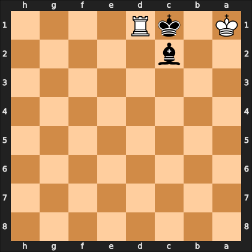](https://lichess.org/analysis/standard/8/8/8/8/8/8/2b5/K1kR4_b_-_-_0_1)<br>`8/8/8/8/8/8/2b5/K1kR4 b - - 0 1`<br>[Lichess analysis](https://lichess.org/analysis/standard/8/8/8/8/8/8/2b5/K1kR4_b_-_-_0_1) | legal position | 2 |
| 11 | `KRvKN` | Black | [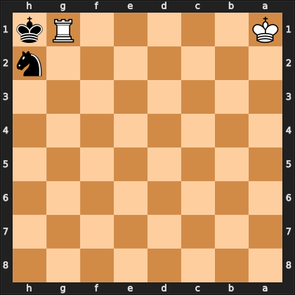](https://lichess.org/analysis/standard/8/8/8/8/8/8/7n/K5Rk_b_-_-_0_1)<br>`8/8/8/8/8/8/7n/K5Rk b - - 0 1`<br>[Lichess analysis](https://lichess.org/analysis/standard/8/8/8/8/8/8/7n/K5Rk_b_-_-_0_1) | legal position | 1 |
| 12 | `KRvKN` | Black | [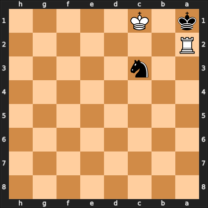](https://lichess.org/analysis/standard/8/8/8/8/8/2n5/R7/k1K5_b_-_-_0_1)<br>`8/8/8/8/8/2n5/R7/k1K5 b - - 0 1`<br>[Lichess analysis](https://lichess.org/analysis/standard/8/8/8/8/8/2n5/R7/k1K5_b_-_-_0_1) | legal position | 2 |

## External Cross-Checks

The potentially legal position counts can be checked against the Syzygy tablebases. Syzygy uses Kirill Kryukov's [Number of Unique Legal Positions](https://kirill-kryukov.com/chess/nulp/) (NULP) definition. In that definition, a position includes side to move, castling rights, and en-passant rights, and "unique" means an equivalence class under easy symmetries such as board mirroring, board rotation, and color swapping. NULP looks at potentially legal positions as we do, thus the comparison is valid.

For example the potentially legal but in fact illegal positions `8/8/8/8/2N5/8/k1K5/1B6 b - - 0 1` and `8/8/8/8/8/B7/B7/k1K5 w - - 0 1` are in the Syzygy tablebase.

### Counts

The Syzygy site displays aggregate WDL outcomes, while its [machine-readable statistics](https://syzygy-tables.info/stats.json) keep the side to move separated. For example, the displayed `KRvK` value of 47,219 White wins is `21,959` White-to-move wins plus `25,260` Black-to-move losses.

The table below gives the corresponding unique representative counts. The unique count is not always the raw count divided by 8, because symmetry operations can lead to identical positions.

| Material class | Scope compared | Raw White to move | Raw Black to move | Raw total | Unique White to move | Unique Black to move | Unique total | Syzygy unique total | Comparison |
| --- | --- | --- | --- | --- | --- | --- | --- | --- | --- |
| `KRvK` | theorem class | 175,168 | 223,944 | 399,112 | 21,959 | 28,056 | 50,015 | 50,015 | matches |
| `KQvK` | theorem class | 144,508 | 223,944 | 368,452 | 18,081 | 28,056 | 46,137 | 46,137 | matches |
| `KBBvK`, opposite bishops | converted to the same generic two-bishop-slot convention as Syzygy | 5,008,256 | 6,938,688 | 11,946,944 | 626,032 | 867,336 | 1,493,368 | n/a | generated subset |
| `KBNvK(light bishop)` | light-bishop theorem class, equivalent to Syzygy `KBNvK` after bishop-colour symmetry | 5,437,752 | 6,830,292 | 12,268,044 | 1,359,578 | 1,707,888 | 3,067,466 | 3,067,466 | matches |
| `KNNvK` | theorem class | 5,749,652 | 6,830,292 | 12,579,944 | 719,130 | 854,238 | 1,573,368 | 1,573,368 | matches |
| `KRvKB(light bishop)` | light-bishop theorem class, equivalent to Syzygy `KRvKB` after bishop-colour symmetry | 5,390,364 | 5,916,232 | 11,306,596 | 1,347,906 | 1,479,198 | 2,827,104 | 2,827,104 | matches |
| `KRvKN` | theorem class | 10,780,728 | 12,535,256 | 23,315,984 | 1,347,906 | 1,567,222 | 2,915,128 | 2,915,128 | matches |
| `KBBvK`, same-colour bishops | generated in the same generic two-bishop-slot convention as Syzygy | 5,155,800 | 6,721,896 | 11,877,696 | 644,510 | 840,552 | 1,485,062 | n/a | generated subset |
| `KBBvK`, sum | sum of the two preceding `KBBvK` rows | 10,164,056 | 13,660,584 | 23,824,640 | 1,270,542 | 1,707,888 | 2,978,430 | 2,978,430 | matches |

The `KBBvK` line needs special care. The theorem is only about opposite-coloured bishops, with one light-square bishop and one dark-square bishop. The Syzygy material key `KBBvK` does not expose a separate statistic for opposite-coloured bishops; it counts the whole two-bishop material table in a generic two-bishop-slot convention. For that external comparison, the opposite-bishop subset is therefore converted to the same convention, the same-colour bishop subset is generated separately, and their sum matches Syzygy exactly.

The Syzygy WDL tables are adversarial tablebases, so they cannot be used to deduce helpmate existence.

The regression test `TestSyzygyCountCrossCheck` independently recomputes all counts in this section without calling the main reachability analyzers.

### Position

Count agreement alone would still leave a theoretical worry: two different position sets can have the same size. For that reason the repository also contains an optional pointwise Syzygy probe:

```sh
python scripts/verify_syzygy_position_sets.py --tablebase PATH_TO_SYZYGY_TABLES

```

The script generates one representative per relevant board-symmetry class and probes each representative against installed Syzygy files with python-chess. It does not use the main reachability analyzers. Each generated record carries explicit piece symbols, and the script checks the actual Syzygy material key of the generated board before probing the WDL table for that key. With `--isolate-table`, the script creates a temporary directory for each selected material containing only that material's `.rtbw` and `.rtbz` files, so a wrong generated material cannot be satisfied by another table in the source directory. Missing table files fail with `FileNotFoundError`; python-chess does not download tables. On 30 May 2026, it was run against the installed Syzygy files with these results:

| Material class | Unique representatives probed |
| --- | --- |
| `KRvK` | 50,015 |
| `KQvK` | 46,137 |
| `KBBvK(opposite bishops)` | 1,493,368 |
| `KBNvK(light bishop)` | 3,067,466 |
| `KNNvK` | 1,573,368 |
| `KRvKB(light bishop)` | 2,827,104 |
| `KRvKN` | 2,915,128 |
| `KBBvK`, all ordered bishop slots | 2,978,430 |

Every generated representative probed successfully. Together with the matching Syzygy/NULP unique counts, this gives a pointwise cross-check that the generated potentially legal positions are sound and complete. The seven theorem classes are probed directly; the expanded all-bishop `KBBvK` row is an additional check for the full Syzygy material table.

## Dependency

This project uses the Maven Central release of Ashlar Chess:

```xml
<dependency>
  <groupId>io.github.dlbbld</groupId>
  <artifactId>ashlar-chess</artifactId>
  <version>20.0.0</version>
</dependency>

```
